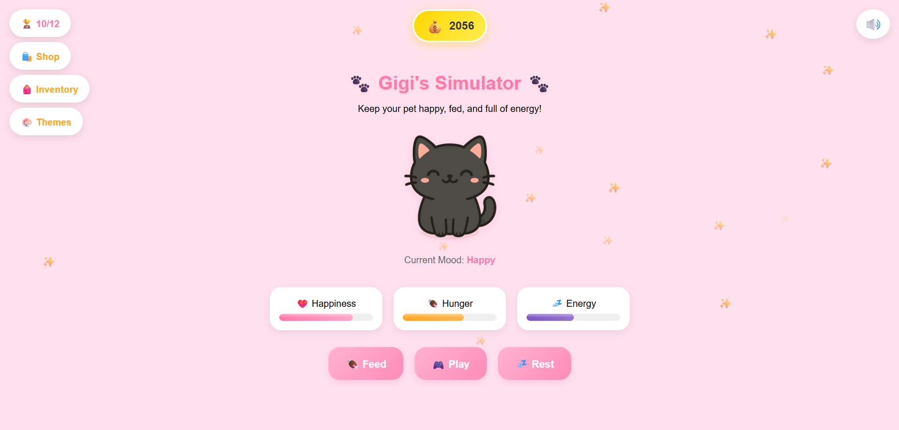

# 🐾 Pet Care Simulator

A cute virtual pet simulator, where players can feed, play, and rest with their adorable pet!
Take care of your companion and keep their mood happy 💖

🎮 **Live Demo:** [https://vawndyu.github.io/Pet-Care-Simulator/](Try it out here)

---

## ✨ Features
- 🐱 **Interactive Pet Moods** — Watch your pet react with happiness, tiredness, hunger, and more.
- 🍖 **Care Actions** — Feed, play, and rest with your pet using fun sound effects.
- 🎵 **Immersive Audio** — Enjoy background music and mood-based sounds that adapt to your pet’s state.
- 💬 **Dynamic Speech Bubbles** — Your pet communicates feelings and needs through expressive dialogue.
- 🛍️ **Pet Shop System** — Earn coins and purchase **themes**, **rename tags**, and **consumable items** to personalize your pet’s experience.
- 🎨 **Customizable Themes** — Change the environment’s look and feel with unlockable themes.
- 🏷️ **Rename Tags** — Give your pet a unique name and identity.
- 📱 **Responsive Design** — Fully optimized for both desktop and mobile play.
- ⚙️ **Built with React + Vite** — Modern, fast, and lightweight front-end framework.
- 🌈 **Deployed on GitHub Pages** — Play instantly online without installation.

---

## 🧠 How to Play
1. Watch your pet’s mood indicators (energy, hunger, happiness).
2. Use the buttons to:
   - **Feed** 🍗 → Restores hunger
   - **Play** 🎾 → Boosts happiness
   - **Rest** 💤 → Regains energy
3. Keep your pet balanced and happy — don’t let stats drop too low!

---

## 🛠️ Tech Stack
| Category | Technology |
|-----------|-------------|
| Frontend | React + Vite |
| Styling | CSS Modules |
| Deployment | GitHub Pages |
| Assets | Custom art and sound effects |

---

## 🖼️ Preview


---

## 🚀 Setup Instructions
To run the project locally:

```bash
# Clone the repository
git clone https://github.com/VawnDyu/Pet-Care-Simulator.git

# Navigate to the folder
cd Pet-Care-Simulator

# Install dependencies
npm install

# Run development server
npm run dev
```

---

## 🧭 Future Ideas
- 🐾 Add more pet types and animations
- 🏡 Add furniture or room decorations for the pet’s home

## 💖 Acknowledgments
- 🎨 Art assets generated with help from **ChatGPT**
- 🎵 Sound effects and Background music sourced from **YouTube (non-copyrighted)**
- 🎵 Built and designed by **VawnDyu**

---

## 📜 License
- This project is licensed under the MIT License.